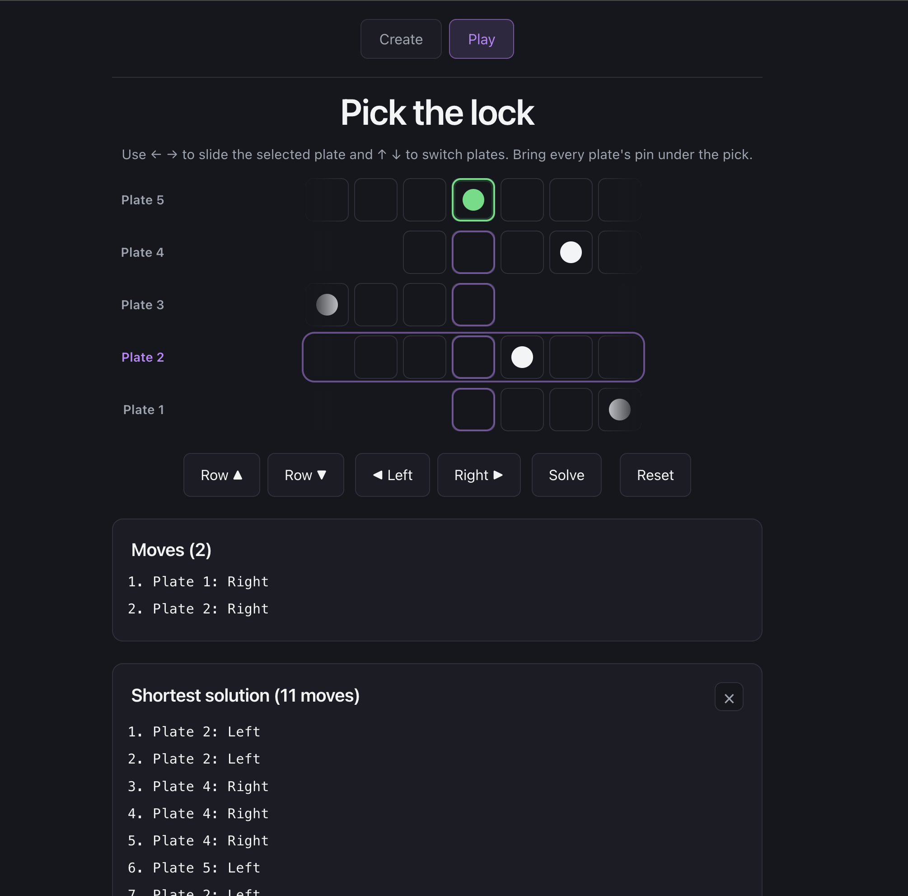

# Gothic 1 Remake Lockpick

<a href="https://vafilor.github.io/gothic-remake-lockpick/?puzzle=JTdCJTIyY29sdW1uQ291bnQlMjIlM0E3JTJDJTIydGFyZ2V0Q29sdW1uJTIyJTNBMyUyQyUyMmluaXRpYWxQb3NpdGlvbnMlMjIlM0ElNUI2JTJDNSUyQzAlMkM1JTJDMSU1RCUyQyUyMnJ1bGVzJTIyJTNBJTVCJTdCJTIybGVmdCUyMiUzQSU1Qi0xJTJDMCUyQzAlMkMtMSUyQzElNUQlMkMlMjJyaWdodCUyMiUzQSU1QjElMkMwJTJDMCUyQzElMkMtMSU1RCU3RCUyQyU3QiUyMmxlZnQlMjIlM0ElNUIxJTJDLTElMkMwJTJDMSUyQzElNUQlMkMlMjJyaWdodCUyMiUzQSU1Qi0xJTJDMSUyQzAlMkMtMSUyQy0xJTVEJTdEJTJDJTdCJTIybGVmdCUyMiUzQSU1QjAlMkMwJTJDLTElMkMwJTJDLTElNUQlMkMlMjJyaWdodCUyMiUzQSU1QjAlMkMwJTJDMSUyQzAlMkMxJTVEJTdEJTJDJTdCJTIybGVmdCUyMiUzQSU1QjAlMkMwJTJDMCUyQy0xJTJDMCU1RCUyQyUyMnJpZ2h0JTIyJTNBJTVCMCUyQzAlMkMwJTJDMSUyQzAlNUQlN0QlMkMlN0IlMjJsZWZ0JTIyJTNBJTVCMCUyQzElMkMtMSUyQy0xJTJDLTElNUQlMkMlMjJyaWdodCUyMiUzQSU1QjAlMkMtMSUyQzElMkMxJTJDMSU1RCU3RCU1RCU3RA%3D%3D#create">
    
</a>

<a href="https://vafilor.github.io/gothic-remake-lockpick/?puzzle=JTdCJTIyY29sdW1uQ291bnQlMjIlM0E3JTJDJTIydGFyZ2V0Q29sdW1uJTIyJTNBMyUyQyUyMmluaXRpYWxQb3NpdGlvbnMlMjIlM0ElNUI2JTJDNSUyQzAlMkM1JTJDMSU1RCUyQyUyMnJ1bGVzJTIyJTNBJTVCJTdCJTIybGVmdCUyMiUzQSU1Qi0xJTJDMCUyQzAlMkMtMSUyQzElNUQlMkMlMjJyaWdodCUyMiUzQSU1QjElMkMwJTJDMCUyQzElMkMtMSU1RCU3RCUyQyU3QiUyMmxlZnQlMjIlM0ElNUIxJTJDLTElMkMwJTJDMSUyQzElNUQlMkMlMjJyaWdodCUyMiUzQSU1Qi0xJTJDMSUyQzAlMkMtMSUyQy0xJTVEJTdEJTJDJTdCJTIybGVmdCUyMiUzQSU1QjAlMkMwJTJDLTElMkMwJTJDLTElNUQlMkMlMjJyaWdodCUyMiUzQSU1QjAlMkMwJTJDMSUyQzAlMkMxJTVEJTdEJTJDJTdCJTIybGVmdCUyMiUzQSU1QjAlMkMwJTJDMCUyQy0xJTJDMCU1RCUyQyUyMnJpZ2h0JTIyJTNBJTVCMCUyQzAlMkMwJTJDMSUyQzAlNUQlN0QlMkMlN0IlMjJsZWZ0JTIyJTNBJTVCMCUyQzElMkMtMSUyQy0xJTJDLTElNUQlMkMlMjJyaWdodCUyMiUzQSU1QjAlMkMtMSUyQzElMkMxJTJDMSU1RCU3RCU1RCU3RA%3D%3D#create">Try it out</a>

This is a reproduction of the lockpicking minigame from the Gothic 1 Remake game.

This features two modes
1. Create mode, where you design the puzzle 
2. Play mode, where you try and solve the puzzle


## Game Mechanics

In the lock picking minigame, you have a variable number of sliding plates. 
Each plate has 7 holes with one pin. The goal is to align all of the pins in each hole to 
the fourth slot.

Some plates may be linked to others. So if you move a plate left, another one or two might move right, and another move left. 


### Representation

For 3 plates, you can represent the game like so:

```
   1 2 3 4 5 6 7
3 |*| | | | | | |
2 | | |*| | | | |
1 | | | | | | |*|
```

Where * represents the current spot.

And the rules can be represented by a matrix.

Legend:
blank = no connection
S = same direction
R = reverse direction (also displayed as Opposite or Opp. in the UI)
X = Same plate, ignore.

```
  1 2 3
1 X S S
2   X R
3 S   X
```

For this one, when you move plate 1 right, plates 2 and 3 also move right.
When you move plate 2 right, plate 3 moves left as it is the reverse.

# Game Modes

## Create Mode

Here you 
1. Choose the number of plates
2. Choose the initial positions of the pins
3. Set up the rules between plates

Once finished, you can switch to Play mode to try it out.
Or, you can click the share button to share it with friends or enemies.

## Play Mode

Here you try to solve the puzzle.

A fixed "pick" sits over the fourth slot of every row. Each plate carries a
single pin, and you solve the puzzle by sliding each plate so its pin lines up
under the pick.

You start with Row 1 - the bottom-most row. 
You slide the selected plate left or right using the left or right arrow keys.
The pick stays put while the plate slides beneath it: pressing left slides the
plate (and its pin) to the right, and pressing right slides it to the left. To
switch rows, use the up and down arrow keys. So up will take you to row 2.

Below the game is the list of actions you have taken, like

Plate 1: Left
Plate 3: Right

Click the "Reset" button to go back to the original setup and clear the list of actions.

Click the "Solve" button to compute the shortest sequence of moves from the
current position and list them below your actions. Because the board has a
finite number of states, a breadth-first search always finds the shortest
solution if one exists, and can tell you for certain when a puzzle is
unsolvable from where you are.

# Project

## To run locally in dev mode,

```bash

npm run dev
```

## To build the project, run

```bash

npm run build
```


## To run tests

```bash

npm run test
```